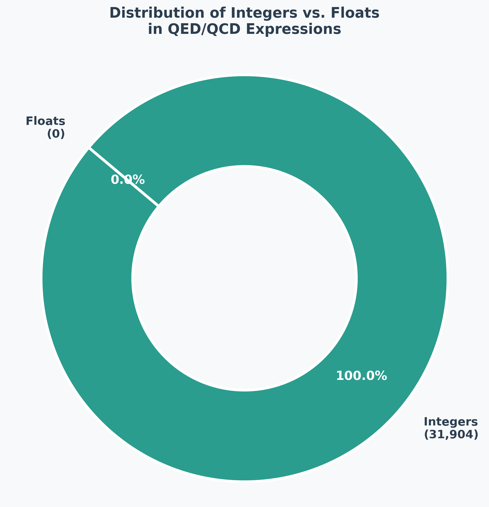

# Ablation Study

I performed an ablation study to analyze performance of different physics-informed components using the Transformer architecture.

## KAN

- I compared two different KAN Heads on a Standard Encoder-Decoder Transformer with RoPE for positional encodings and reported performance for SineKAN and Chebyshev Polynomial based KAN (using first kind polynoimals).
- The SineKAN head gave +1.65% token_accuracy gain and +5.56% sequence_accuracy gain on the QED Dataset and +4.70% token_accuracy gain and +8.70% sequence_accuracy gain on the QCD Dataset over Chebyshev Polynomial KAN.
- Chebyshev Polynomial KAN was evaluated as an alternative because of faster execution compared to sine-based activations.
- The token_accuracies of SineKAN were further improved by utilising SIREN activation in both Encoder and Decoder.

## MoE

I tested a Sparsely Gated MoE head using SineKAN experts with a total of 8 experts, where 2 experts are activated per token (top-2).

This gave 99.18% token_accuracy and 66.67% sequence_accuracy on the QED Dataset and 90.30% token_accuracy and 65.22% sequence_accuracy on the QCD Dataset.

An auxiliary loss was used for load balancing of experts.

Loss = Loss_CE + 0.01 * Loss_aux

where, Loss_CE is the token level Cross Entropy loss and Loss_aux is the auxiliary MoE load balancing loss.

## Dual Head Architecture

- Further, I added dual heads on the SineKAN Transformer, this separates structural token prediction from numerical value estimation.
- For this model I updated the tokenizer to not merge any numeric value occuring in the expressions except for the growing indices that were to be normalised.
- I used Huber Loss for numeric errors, as numeric Regression loss should not dominate the symbolic Cross Entropy loss.

Loss = Loss_CE + num_weight * Loss_num

where,
- Loss_CE = Cross Entropy loss over all tokens
- Loss_num = SmoothL1 computed only on positions where target token is numeric
- num_weight = weighting factor (0.5 in my study)

At inference time I rounded off the values output by the numeric head to the closest integer.

  

Fig: From this plot we can observe that all numeric values in the dataset were integers.

 

This approach gave a **96.39%** token_accuracy and **88.89%** sequence_accuracy on the QED Dataset and **97.43%** token_accuracy and **65.22%** sequence_accuracy on the QCD Dataset.

## Combining different Heads

I combined the SineKAN MoE and Dual Head architecture which gave a 99.40% token_accuracy and 69.44% sequence_accuracy on the QED Dataset and 95.77% token_accuracy and 52.17% sequence_accuracy on the QCD Dataset.
