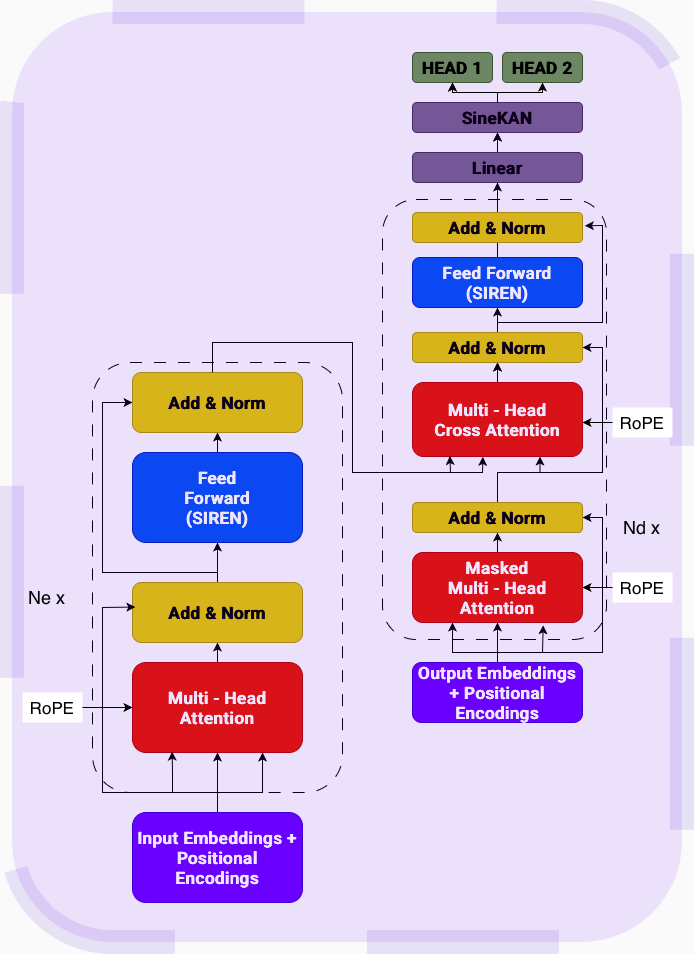

# Specific Task 2.2

I developed a physics-informed dual head transformer for squared amplitude calculation.

Find all model weights at [link](https://drive.google.com/drive/folders/1ee1gqKr-H4R3zz_dK6ZFfA-w2e5fXSfr?usp=share_link)

## Architecture

The following architecture was implemented for Dual Heads:

  

