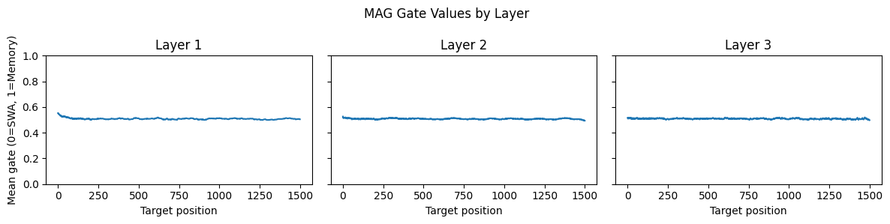

# SYMBA Titans Tasks

## Overview

This repo is my submissionn of evaluation tasks for **Titans for Squared Amplitude Calculation** SYMBA, ML4Sci.

## Folders

1. Folder [Common Task 1.2](./Common_Task_1.2/) contains notebook for tokenization and rationale of choice.
2. Folder [Specific Test 2.4](./Specific_Test_2.4/) contains notebooks for Titan variants and baselines.
3. Folder [Optional Specific Task 2.2](./Optional_Specific_Task_2.2/) contains notebooks for the Physics-Informed Transformer architecture.

## Problem Statement

Squared Amplitudes play a major role in calculation cross-section or probabilty that a particular process takes place in the interaction of elementary particles. Using Amplitude expressions one can use a Seq2Seq model to get Squared Amplitude expressions.

## Common Task 1.2 

Tokenisation and Dataset Preprocessing

Dataset: [Link](https://alabama.app.box.com/s/xhgr2onrn503jyse2fs5vxtapg0oifcs)  

For Details: [Readme](./Common_Task_1.2/README.md)

## Specific Task 2.4

Titans architecture combined with MIRAS for Squared Amplitude Calculation

For Details and model weights: [Readme](./Specific_Test_2.4/README.md)

## Results

### QED

| Model | Number of Encoders | Number of Decoders | Token Accuracy | Sequence Accuracy |
| ----- | ------------------ | ------------------ | -------------- | ----------------- |
| Transformer Baseline | 3 | 3 | **99.97\%** | **97.22\%** |
| MAL Encoder Decoder | 3 | 3 | 99.84\% | 91.67\% |
| MAG Encoder Decoder | 3 | 3 | **99.97\%** | **97.22\%** |
| MAC Encoder Decoder | 2 | 2 | 36.55\% | 19.44\% |

### QCD

| Model | Number of Encoders | Number of Decoders | Token Accuracy | Sequence Accuracy |
| ----- | ------------------ | ------------------ | -------------- | ----------------- |
| Transformer Baseline | 3 | 3 | 83.86\% | 66.67\% |
| MAL Encoder Decoder | 3 | 3 | **94.15\%** | 79.17\% |
| MAG Encoder Decoder | 3 | 3 | 55.10\% | 70.83\% |
| MAG Encoder Decoder (Gating Disabled) | 3 | 3 | 85.38\% | **91.67\%** |
| MAC Encoder Decoder | 3 | 3 | 48.46\% | 00.00\% |

### MAG Analysis

We analyze the gating behavior of the MAG module by capturing gate activations from each decoder layer using forward hooks during inference. The sigmoid-normalized gate values are averaged across samples and feature dimensions to obtain mean gate trajectories over **target positions.**

This provides insight into the model’s reliance on memory vs. local attention (SWA) across layers.

Further Discussion: [Readme](./Specific_Test_2.4/MAG/README.md)

## Optional Specific Task 2.2

Physics-Informed Models for Squared Amplitude Calculation

For Details and model weights: [Readme](./Optional_Specific_Task_2.2/README.md)

## Results

### QED

| Model | Transformer | KAN | SIREN Activation | MoE | Dual Heads | Token Accuracy | Sequence Accuracy |
| ----- | ----------- | --- | ---------------- | --- | ---------- | -------------- | ----------------- |
| Transformer Baseline | ✓ | ✗ | ✗ | ✗ | ✗ | 99.97\% | **97.22\%** |
| SineKAN Head | ✓ | ✓ | ✗ | ✗ | ✗ | 99.41\% | 75.00\% |
| Chebyshev Head | ✓ | ✓ | ✗ | ✗ | ✗ | 97.76\% | 69.44\% |
| SineKAN Head + SIREN | ✓ | ✓ | ✓ | ✗ | ✗ | 99.47\% | 72.22\% |
| SineKAN MoE | ✓ | ✓ | ✗ | ✓ | ✗ | 99.18\% | 66.67\% |
| Dual Heads  | ✓ | ✓ | ✓ | ✗ | ✓ | 96.39\% | 88.89\% |
| SineKAN MoE + Dual Heads | ✓ | ✓ | ✓ |  ✓ | ✓ | **99.40\%** | 69.44\% |

### QCD

| Model | Transformer | KAN | SIREN Activation | MoE | Dual Heads | Token Accuracy | Sequence Accuracy |
| ----- | ----------- | --- | ---------------- | --- | ---------- | -------------- | ----------------- |
| Transformer Baseline | ✓ | ✗ | ✗ | ✗ | ✗ | 83.86\% | **66.67\%** |
| SineKAN Head | ✓ | ✓ | ✗ | ✗ | ✗ | 97.96\% | 65.22\% |
| Chebyshev Head | ✓ | ✓ | ✗ | ✗ | ✗ | 93.26\% | 56.52\% |
| SineKAN Head + SIREN | ✓ | ✓ | ✓ | ✗ | ✗ | **98.00\%** | 65.22\% |
| SineKAN MoE | ✓ | ✓ | ✗ | ✓ | ✗ | 90.30\% | 65.22\% |
| Dual Heads  | ✓ | ✓ | ✓ | ✗ | ✓ | 97.43\% | 65.22\% |
| SineKAN MoE + Dual Heads | ✓ | ✓ | ✓ |  ✓ | ✓ | 95.77\% | 52.17\% |

## Observations

### Task 2.4

- Titans-based architectures (MAL/MAG) achieve performance competitive with or matching Transformer baseline on QED dataset.
- In QCD, Titans variants show clear advantages with MAL variant delivering the most consistent improvements.
- MAG variant was observed to benefit from controlled gating behavior, particularly on the QCD dataset.

### Task 2.2

- Physics-informed components (KAN/SIREN) improve token-level precision.
- Dual-head design improves representation learning by separating numerical and symbolic predictions.

## References

1. Behrouz, A., Razaviyayn, M., Zhong, P., & Mirrokni, V. (2025). *Titans: Learning to Memorize at Test Time*. arXiv:2501.00663.  
2. Behrouz, A., Razaviyayn, M., Zhong, P., & Mirrokni, V. (2025). *It’s All Connected: A Journey Through Test-Time Memorization, Attentional Bias, Retention, and Online Optimization*. arXiv:2504.13173.  
3. Gu, A., & Dao, T. (2023). *Mamba: Linear-Time Sequence Modeling with Selective State Spaces*. arXiv:2312.00752.  
4. Alnuqaydan, A., et al. (2023). *SYMBA: Symbolic Computation of Squared Amplitudes in High Energy Physics with Machine Learning*. Machine Learning: Science and Technology, 4(1), 015007.

## Contact

For any queries regarding this repository, please contact `arnavtripathi5284@gmail.com`
