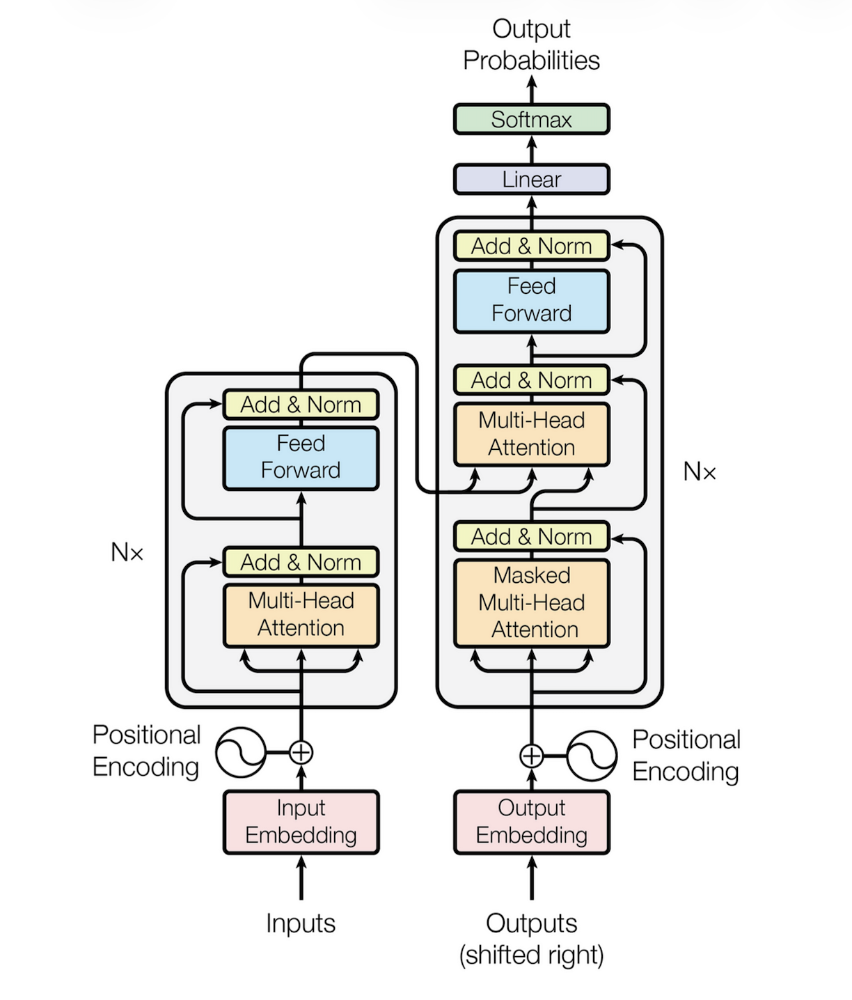

# Baseline Architecture

A strong baseline serves as a reliable reference point, ensuring that any observed improvement is meaningful.

I have trained a Standard Encoder-Decoder style transformer with 3 Encoder and 3 Decoder blocks.

## Architecture

  

