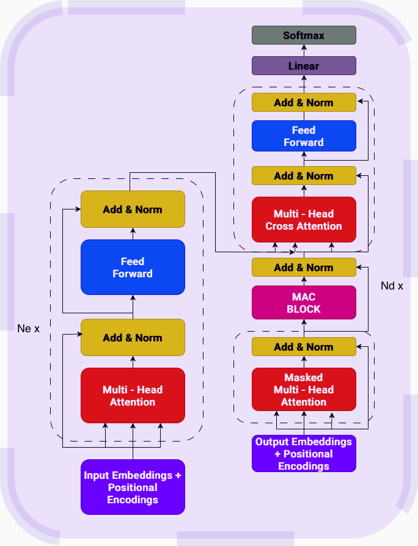

# MAC Variant

Memory-As-Context variant achieved a token_accuracy of 36.55% and sequence_accuracy of 19.44% on QED Dataset and 48.46% token_accuracy and 00.0% sequence accuracy on the tougher QCD Dataset.

This variant showed limited lower accuracy compared to the baseline, indicating the current memory integration requires further architecture refinement.

## MAC Implementation Details

### 1. Chunk-Level Gating for Memory Updates

The underlying Neural Memory module in this MAC implementation utilizes Chunk-Level Mean Pooling to extract a global context $\mathbf{c} \in \mathbb{R}^{1 \times d}$ from the current input sequence chunk $\mathbf{X} \in \mathbb{R}^{L \times d}$:

$$\mathbf{c} = \frac{1}{L} \sum_{i=1}^{L} \mathbf{x}_i$$

The context vector is then passed through linear gating layers and a Sigmoid activation to generate scalar multipliers for the base optimizer hyperparameters (learning rate $\theta$, momentum $\eta$ and weight decay $\alpha$):

$$\theta = \lambda_{\text{base}} \cdot \mathbb{E}[\sigma(W_{\theta}\mathbf{c} + b_{\theta})]$$
$$\eta = \mu_{\text{base}} \cdot \mathbb{E}[\sigma(W_{\eta}\mathbf{c} + b_{\eta})]$$
$$\alpha = \gamma_{\text{base}} \cdot \mathbb{E}[\sigma(W_{\alpha}\mathbf{c} + b_{\alpha})]$$

### 2. Token Wise Retrieval and Identity Masking

The implementation performs **dynamic token-wise retrieval** for the chunk. The entire chunk is used as a query to retrieve a parallel sequence of memory states:

```math
\mathbf{H}_{t} = \text{MemoryRetrieve}(\mathbf{X}_{\text{chunk}}, \mathbf{S}_{t-1})
```

<br>

When computing self-attention these states are concatenated as a prefix for the local Keys and Values:

```math
\mathbf{K}_{\text{chunk}} = [\mathbf{H}_{t}^{K}; \mathbf{K}_{\text{local}}]
```

```math
\mathbf{V}_{\text{chunk}} = [\mathbf{H}_{t}^{V}; \mathbf{V}_{\text{local}}]
```

<br>

Crucially, the short term attention mechanism is restricted by an **identity mask**:

```math
\mathbf{I} \in \mathbb{R}^{L \times L}
```

<br>

This strictly forces the $i$-th token to attend only to its own uniquely retrieved memory vector $H_{t,i}$, preventing cross-token memory access.

## Architecture

I used a standard Encoder and a MAC augmented Decoder for the architecture.

<div align="center">
  
</div>
