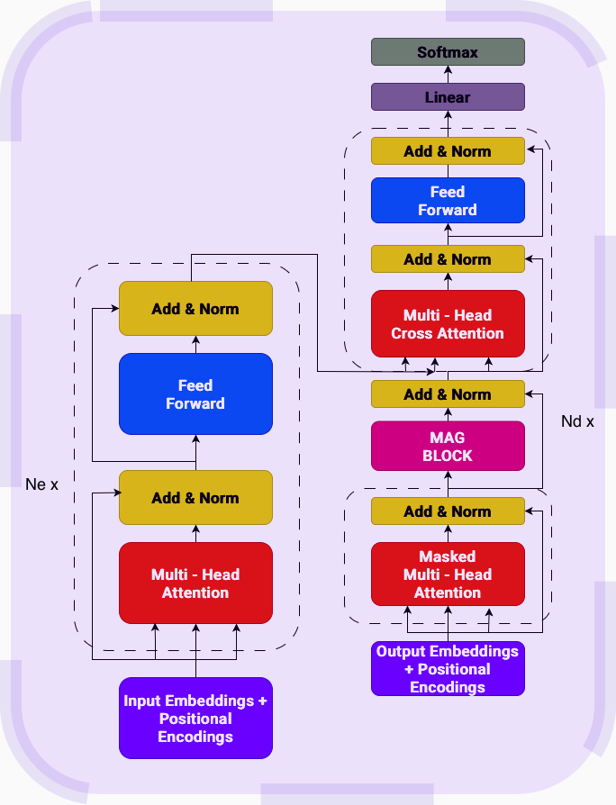

# MAG Variant

Memory-As-Gate variant achieved a token_accuracy of 99.97% and sequence_accuracy of 97.22% on the QED Dataset and token_accuracy of 55.10% and sequence_accuracy of 70.83% on the QCD Dataset.

## Ablation Study

To analyze the gating behavior, I observed the mean gate activations in the Decoder Layers across samples and feature dimensions as a function of target positions.

The plot suggests the router does not favor either SWA branch or the Memory branch.

The mean stayed near ~0.5 for all positions across layers and acted like an uniform mixture of the SWA branch and the memory branch. To further understand whether the gate is not learning to separate the two branches or sees both branch useful I performed a **branch ablation** (while keeping rest of the pipeline same) by isolating branches one-by-one and atlast fixing a constant value of 0.5 for gate to observe any improvement in accuracies.

NOTE: These experiments were performed for QCD Dataset as performance on QED Dataset was notably high.

## Results

| Model | Token Accuracy | Sequence Accuracy |
| ----- | -------------- | ----------------- |
| MAG Encoder Decoder | 55.10\% | 70.83\% |
| MAG (SWA only) | **85.38\%** | **91.67\%** |
| MAG (Memory only) | 52.73\% | 75.00\% |
| MAG (fixed 0.5 gate) | 73.14\% | 75.00\% |

These results suggest that the current MAG gating mechanism requires further study and refinement for this task, as the gated two branch model underperforms the SWA only model, indicating that the gate is not yet effectively exploiting both branches.

## Arcihtecture

I used Encoder-Decoder style architecture with MAG augmented Decoder. Both Encoder and Decoder had 3 layers each.

  

