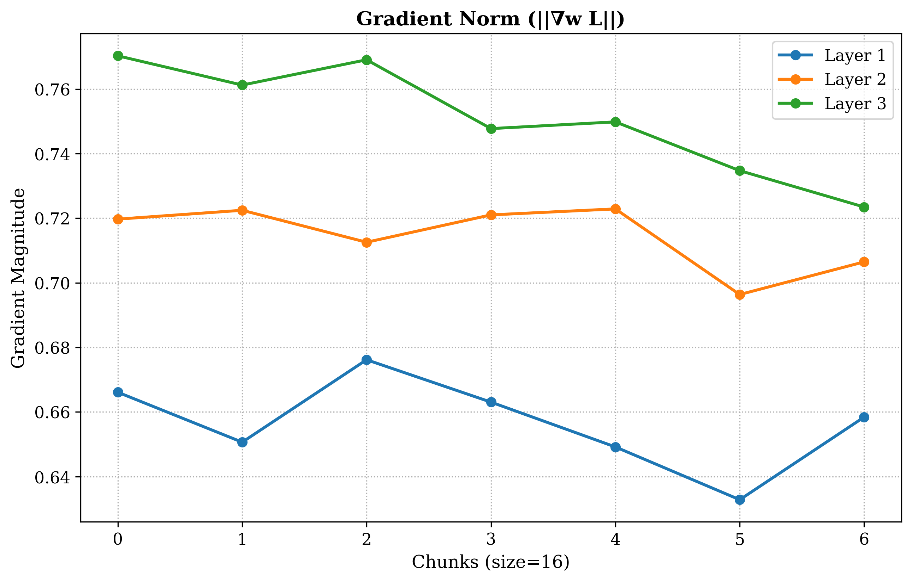
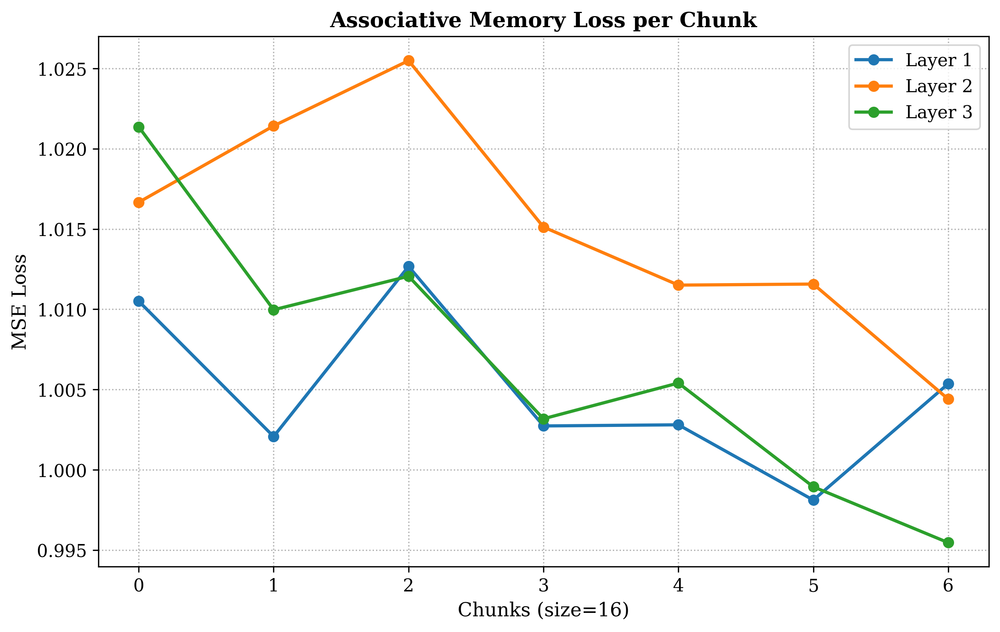
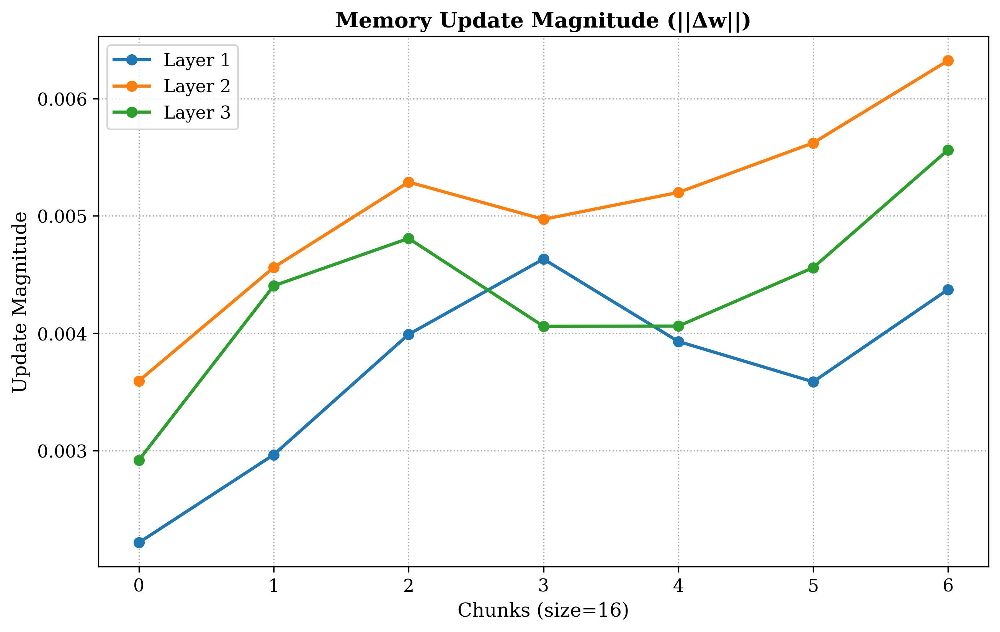
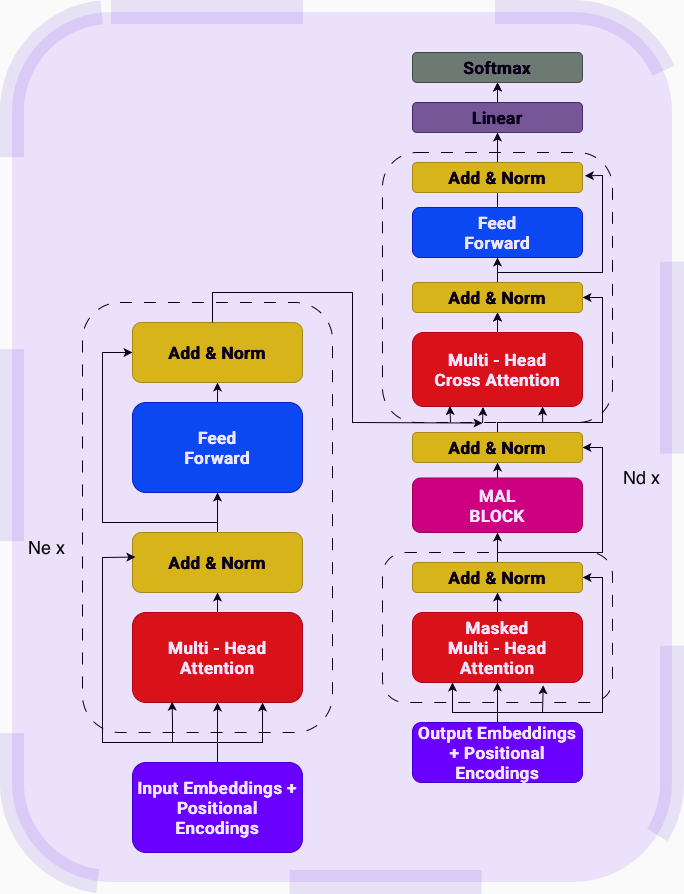

# MAL Variant

Memory-As-Layer variant achieved 99.84% token_accuracy and 91.67% sequence_accuracy on the QED Dataset and 94.15% token_accuracy and 79.17% sequence_accuracy on the QCD Dataset.

## Memory Diagnostics

To understand the test time learning more I logged three internal signals (for a single sequence of QED Dataset) per Decoder layer: Gradient Norm (||∇w​L||), associative memory loss and memory update magnitude (||Δw||).

  

 

The above gradient norm plot shows gradual decline in gradient magnitude for some layers across later chunks which indicates memory becomes slightly less surprised as the sequence progress which is a desirable behavior for an adaptive memory system.

  

 

$$\mathcal{L}_{assoc} = \frac{1}{N} \sum_{i=1}^{N} \| \text{MLP}_{W_{t-1}}(k_i) - v_i \|^2$$

The associative memory loss plot shows that the memory is actively trying to fit the key-to-value mapping inside each chunk. The loss values remain close to 1.0 so the absolute reduction is moderate.

  

 

This plot reflects how much internal memory weights are changing. Layer 2 has the largest update magnitude overall while Layer 1 has the smallest. Layer 3 starts with relatively small updates but becomes more active toward later chunks, which aligns with its improving loss trend.

The current results are derived from a single sequence and primarily serve as a qualitative validation of the MAL memory dynamics. Future work will involve scaling this analysis to a larger evaluation set and reporting aggregated metrics (mean ± variance) across sequences. Such a study would allow for statistically robust conclusions regarding layer wise sensitivity, memory efficiency and update dynamics.

## MAL Implementaion Details

### 1. Chunk Context Extraction
Instead of computing token-by-token gates the model extracts a global context vector $\mathbf{c}$ from the current input sequence chunk $\mathbf{X} \in \mathbb{R}^{L \times d}$ by mean-pooling across the sequence length $L$.

$$\mathbf{c} = \frac{1}{L} \sum_{i=1}^{L} \mathbf{x}_i$$

### 2. Data-Dependent Gating
The context vector dynamically modulates the base optimizer hyperparameters. By passing $\mathbf{c}$ through linear gating layers and taking the expected value (mean) of the output features the model generates scalar multipliers for the learning rate ($\theta$), momentum ($\eta$) and weight decay ($\alpha$).

$$\theta = \lambda_{\text{base}} \cdot \mathbb{E} \left[ \mathbf{W}_\theta \mathbf{c} + \mathbf{b}_\theta \right]$$

$$\eta = \mu_{\text{base}} \cdot \mathbb{E} \left[ \mathbf{W}_\eta \mathbf{c} + \mathbf{b}_\eta \right]$$

$$\alpha = \gamma_{\text{base}} \cdot \mathbb{E} \left[ \mathbf{W}_\alpha \mathbf{c} + \mathbf{b}_\alpha \right]$$

### 3. Key-Value Projections
The input chunk is linearly projected and normalized to form the retrieval keys $\mathbf{K}$ and target values $\mathbf{V}$.

$$\mathbf{K} = \text{Norm}_K(\mathbf{X} \mathbf{W}_K)$$
$$\mathbf{V} = \text{Norm}_V(\mathbf{X} \mathbf{W}_V)$$

### 4. Associative Memory Loss
The surprise metric is computed as follows:

$$\mathcal{L}_{assoc} = \frac{1}{L} \sum_{i=1}^{L} \| \text{MLP}_{\mathbf{W}_{t-1}}(\mathbf{k}_i) - \mathbf{v}_i \|_2^2$$

### 5. Differentiable Weight Optimization
Using the gradients of the associative loss the memory updates its weights via a momentum based gradient descent step. This inner optimization loop is fully differentiable (`create_graph=True`) allowing the outer network to learn how to gate the memory updates effectively.

First, compute the gradient of the loss with respect to the weights:

$$\mathbf{G}_t = \nabla_{\mathbf{W}_{t-1}} \mathcal{L}_{assoc}$$

Next, update the localized momentum state $\mathbf{M}$:

$$\mathbf{M}_t = \eta \mathbf{M}_{t-1} - \mathbf{G}_t$$

Finally, apply the weight decay and add the momentum scaled gradient to update the neural memory for the next sequence chunk:

$$\mathbf{W}_t = (1 - \alpha) \mathbf{W}_{t-1} + \theta \mathbf{M}_t$$

## Architecture

For both datasets I used 3 Encoder and 3 Decoder Layers.

  

